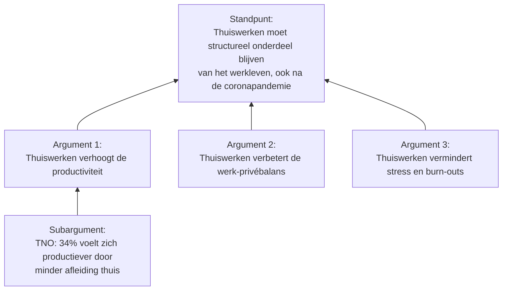

**Standpunt:**  
Thuiswerken moet structureel onderdeel blijven van het werkleven, ook na de coronapandemie.

**Argumentatie:**  
Thuiswerken heeft tijdens de coronaperiode bewezen dat het niet alleen mogelijk is, maar ook effectief. Daarom moet deze manier van werken behouden blijven, zelfs als gedeeltelijke optie.

Ten eerste blijkt uit onderzoek van TNO dat thuiswerken voor veel werknemers leidt tot een hogere productiviteit. 34% van de ondervraagden gaf aan dat ze zich thuis beter kunnen concentreren, doordat ze minder last hebben van afleiding op de werkvloer, zoals rumoerige collega’s of overbodige vergaderingen. Dit is een duidelijke winst voor zowel werknemer als werkgever. [Bron](https://www.tno.nl/nl/newsroom/insights/2020/11/thuiswerken-leidt-werkstress/)

Een ander belangrijk punt is de werk-privébalans. Veel mensen geven aan dat ze het fijn vinden om hun dag flexibeler in te delen. Ze houden meer tijd over voor hun gezin of hobby’s, wat hun mentale gezondheid versterkt. In een tijd waarin burn-outs en stressklachten sterk toenemen, is dat een waardevol voordeel.

Kortom: thuiswerken biedt aantoonbare voordelen op het gebied van productiviteit en welzijn. Het zou zonde zijn om deze kans te laten liggen nu we weten dat het werkt.

<<<<<<< HEAD

=======

> [!example] Argumentatie Diagram
> ![[argumentatiediagram.png]]
>>>>>>> 36e9d0b22e5d4c45f05bbdf713e3e1887cb988ff

